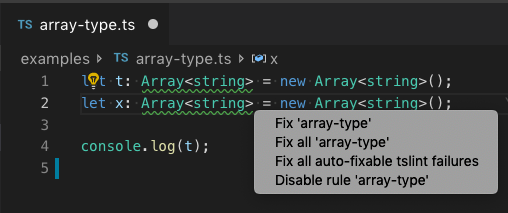
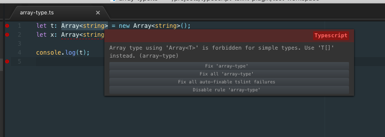

# TypeScript TSLint Language Service Plugin

[](https://travis-ci.org/Microsoft/typescript-tslint-plugin)

TypeScript [language service plugin](https://blogs.msdn.microsoft.com/typescript/2017/04/27/announcing-typescript-2-3/) for [TSLint][tslint]. 

To use the plugin:

* Install TSLint 5+ in your workspace or globally.

* Install the plugin with `npm install typescript-tslint-plugin`

* Enable the plugin in your `tsconfig.json` file:

    ```json
    {
      "compilerOptions": {
        "plugins": [
          { "name": "typescript-tslint-plugin" }
        ]
      }
    }
    ```

See [editor support](#editor-support) for more detailed setup instructions.

## Configuration options

**Notice**: This configuration settings allow you to configure the behaviour of the typescript-tslint-plugin itself. To configure rules and tslint options you should use the `tslint.json` file.

 * `configFile` - The configuration file that tslint should use instead of the default tslint.json. A relative file path is resolved relative to the project root.
 * `ignoreDefinitionFiles` - Control if TypeScript definition files should be ignored.
 * `alwaysShowRuleFailuresAsWarnings` - Always show rule failures as warnings, ignoring the severity configuration in the tslint.json configuration.
 * `disableNoUnusedVariableRule` - Disable `no-unused-variable` rule.
 * `suppressWhileTypeErrorsPresent` - Supress tslint errors from being reported while other errors are present.
 * `mockTypeScriptVersion` - Force tslint to use the same version of TypeScript as this plugin. This will affect other plugins that require the typescript package.

Here is a configuration sample:

```json
{
  "compilerOptions": {
    "plugins": [
      {
        "name": "typescript-tslint-plugin",
        "alwaysShowRuleFailuresAsWarnings": false,
        "ignoreDefinitionFiles": true,
        "configFile": "../tslint.json",
        "disableNoUnusedVariableRule": false,
        "suppressWhileTypeErrorsPresent": false,
        "mockTypeScriptVersion": false
      }
    ]
  }
}
```

**Notice**: due to an issue in the implementation of the `no-unused-variable` rule ([palantir/tslint#2469](https://github.com/palantir/tslint/issues/2649)), this rule will be disabled by the plugin. You can use the typescript compiler options `noUnusedLocals` and `noUnusedParameters` instead. 


# Editor Support
This plugin requires TypeScript 2.4 or later. It can provide intellisense in both JavaScript and TypeScript files within any editors that uses TypeScript to power their language features.

## With VS Code
*If you also have the [vscode-tslint](https://marketplace.visualstudio.com/items?itemName=eg2.tslint) extension in VS Code installed, please disable it to avoid that files are linted twice.*

The simplest way to use this plugin is to install the (TypeScript TSLint Plugin VS Code extension)[https://marketplace.visualstudio.com/items?itemName=ms-vscode.vscode-typescript-tslint-plugin]. This extension enables the plugin when using VS Code's version of TypeScript.

If you are using a workspace version of TypeScript, you must manually install the plugin alongside the version of TypeScript in your workspace:

```bash
npm install --save-dev typescript-tslint-plugin typescript
```

Then add a `plugins` section to your [`tsconfig.json`](http://www.typescriptlang.org/docs/handbook/tsconfig-json.html) or [`jsconfig.json`](https://code.visualstudio.com/Docs/languages/javascript#_javascript-project-jsconfigjson)

```json
{
  "compilerOptions": {
    "plugins": [
      {
        "name": "typescript-tslint-plugin"
      }
    ]
  }
}
```

Finally, run the `Select TypeScript version` command in VS Code to switch to use the workspace version of TypeScript for VS Code's JavaScript and TypeScript language support. You can find more information about managing typescript versions [in the VS Code documentation](https://code.visualstudio.com/Docs/languages/typescript#_using-newer-typescript-versions).



The most important differences between the `vscode-tslint` extension and `typescript-tslint-plugin` are:

* The plugin shares the program representation with TypeScript. This is more efficient than the `vscode-tslint` extension which needs 
  to reanalyze the document.
* Since `vscode-tslint` lints one file a time only, it cannot support tslint rules that require the type checker. The plugin doesn't have this limitation.
* `vscode-tslint` provides additional [features](https://marketplace.visualstudio.com/items?itemName=eg2.tslint), please file issue requests for the features you are missing.


### With Atom
This plugin works with the [Atom TypeScript plugin](https://atom.io/packages/atom-typescript).

First install the plugin and a copy of TypeScript in your workspace:

```bash
npm install --save-dev typescript-tslint-plugin typescript
```

Then add a `plugins` section to your [`tsconfig.json`](http://www.typescriptlang.org/docs/handbook/tsconfig-json.html) or [`jsconfig.json`](https://code.visualstudio.com/Docs/languages/javascript#_javascript-project-jsconfigjson) and restart Atom.

```json
{
  "compilerOptions": {
    "plugins": [
      {
        "name": "typescript-tslint-plugin"
      }
    ]
  }
}
```




### With Sublime
This plugin works with the [Sublime TypeScript plugin](https://github.com/Microsoft/TypeScript-Sublime-Plugin).

First install the plugin and a copy of TypeScript in your workspace:

```bash
npm install --save-dev typescript-tslint-plugin typescript
```

And configure Sublime to use the workspace version of TypeScript by [setting the `typescript_tsdk`](https://github.com/Microsoft/TypeScript-Sublime-Plugin#note-using-different-versions-of-typescript) setting in Sublime:

```json
{
  "typescript_tsdk": "/Users/me/my-amazing-project/node_modules/typescript/lib"
}
```

Finally add a `plugins` section to your [`tsconfig.json`](http://www.typescriptlang.org/docs/handbook/tsconfig-json.html) or [`jsconfig.json`](https://code.visualstudio.com/Docs/languages/javascript#_javascript-project-jsconfigjson) and restart Sublime.

```json
{
  "compilerOptions": {
    "plugins": [
      {
        "name": "typescript-tslint-plugin"
      }
    ]
  }
}
```


### With Visual Studio
This plugin works [Visual Studio 2017](https://www.visualstudio.com) using the TypeScript 2.5+ SDK.

First install the plugin in your project:

```bash
npm install --save-dev typescript-tslint-plugin
```

Then add a `plugins` section to your [`tsconfig.json`](http://www.typescriptlang.org/docs/handbook/tsconfig-json.html).

```json
{
  "compilerOptions": {
    "plugins": [
      {
        "name": "typescript-tslint-plugin"
      }
    ]
  }
}
```

Then reload your project to make sure the plugin has been loaded properly. Note that `jsconfig.json` projects are currently not supported in Visual Studio.


# Contributing
To build the typescript-tslint-plugin, you'll need [Git](https://git-scm.com/downloads) and [Node.js](https://nodejs.org/).

First, [fork](https://help.github.com/articles/fork-a-repo/) the typescript-tslint-plugin repo and clone your fork:

```bash
git clone https://github.com/YOUR_GITHUB_ACCOUNT_NAME/typescript-tslint-plugin.git
cd typescript-tslint-plugin
```

Then install dev dependencies:

```bash
npm install
```

The plugin is written in [TypeScript](http://www.typescriptlang.org). The source code is in the `src/` directory with the compiled JavaScript output to the `lib/` directory. Kick off a build using the `compile` script:

```bash
npm run compile
```

Please also see our [Code of Conduct](CODE_OF_CONDUCT.md).

## VS Code

To test the newly compiled program, open the `test-workspace` folder in VS Code and use the TypeScript version picker to [switch to the local version of TypeScript](https://code.visualstudio.com/Docs/languages/typescript#_using-newer-typescript-versions).

To debug you use two versions of VS Code, e.g., the stable and the insider version. The idea is that one of them is configured to support attaching a debugger to the Typescript language server:

- Use the insider version for development and open it on the typescript-tslint-plugin workspace.
- Use the stable version for debugging opened on the `test-workspace` folder of the tslint-language service.

To setup the stable version for debugging, you need to set the environment variable `TSS_DEBUG` to port 5859. In a command prompt/shell:

- make sure that the stable version isn't running already
- `set TSS_DEBUG=5859`
- cd to the `dev` folder
- `code .`

To debug the tslint-language-service plugin press `F5`. The `dev` workspace has a launch configuration that attaches through port 5859 to the language server. 

# Credits

This project was forked from  https://github.com/angelozerr/tslint-language-service which itself is based on https://github.com/Microsoft/vscode-tslint/


[tslint]: https://github.com/palantir/tslint